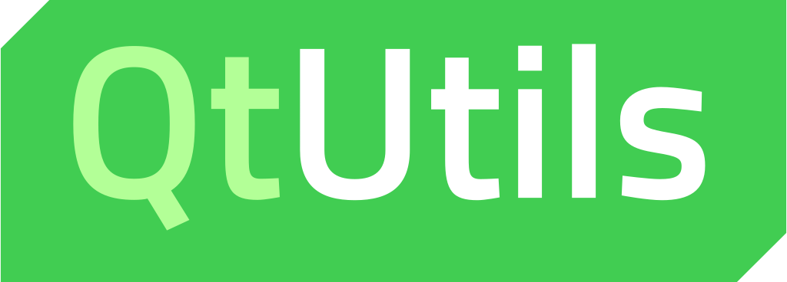

<div align="center">
	
</div>

# QtUtils

[](https://mit-license.org/)
[](https://www.qt.io)
[](https://www.qt.io)
[](https://www.qt.io)

**QtUtils** is a set of basic utilities that I consider should be part of Qt API. It contains many helpers that improve the Qt experience, from dealing with `enum` to usage of pointers.

---

### Table of Contents

- [Requirements](#requirements)
- [Usage](#usage)
- [Content](#content)
- [Author](#author)
- [License](#license)

---

## Requirements

- Platform: Windows, MacOS, Linux.
- [CMake 3.21+](https://cmake.org/download/)
- [Qt 5.15+](https://www.qt.io/download-qt-installer)

## Usage

1. Add the library as a dependency with CMake FetchContent.

   ```cmake
   include(FetchContent)
   FetchContent_Declare(QtUtils
    GIT_REPOSITORY "https://github.com/oclero/qtutils.git"
   )
   FetchContent_MakeAvailable(QtUtils)
   ```

2. Link with the library in CMake.

   ```cmake
   target_link_libraries(your_project oclero::QtUtils)
   ```

3. Include headers in your C++ file.

   ```c++
   #include <oclero/QtConnectionUtils.hpp>
   ```

## Content

### QtConnectionUtils

#### Single-shot Connection

This connection handling will be called only once.

```cpp
oclero::singleShotConnect(this, &SomeClass::someSignalTriggered, []() {
  // Do stuff.
});
```

### QtScopedConnection

- This connection will be closed when it is destroyed, i.e. when the scope it belongs ends. It's a RAII `QMetaObject::Connection`.

  ```cpp
  oclero::QtScopedConnection scopedConnection = QObject::connect(this, &SomeClass::someSignalTriggered, []() {
    // Do stuff.
  });
  ```

- This `QMetaObject::Connection` container will close its content RAII-style.

  ```cpp
  oclero::QtScopedConnections scopedConnections;
  scopedConnections.add(QObject::connect(this, &SomeClass::someSignalTriggered, []() {
    // Do stuff.
  }));
  ```

### QtEnumUtils

- Converts `enum` to `QString` and vice-versa. Checks if the value is valid.

  ```cpp
  auto str = oclero::enumToString(SomeEnum::SomeValue);
  auto value = oclero::enumFromString<SomeEnum>("SomeValue");
  ```

- Converts `enum` to `int` and checks if the value is valid.

  ```cpp
  auto value = oclero::enumFromInt(3);
  ```

### QtEventFilterUtils

Tired of writing a new class just to hook on an event? Now you can just write this:

```cpp
oclero::EventFilter<QEvent::MouseButtonPress>::install(watchedObject, [](QMouseEvent* e) {
  // Do stuff.
  // Return 'true' to block the event propagation, 'false' otherwise.
  return false;
});
```

All corresponding `QEvent`-derived classes have been mapped to their corresponding `QEvent::Type`, so you don't even have to cast the `QEvent` or worry about its type.

### QtPointerUtils

- A unique pointer that will call `QObject::deleteLater` instead of `delete` when its scope ends.

  ```cpp
  oclero::QtDeleteLaterScopedPointer<QObject> scopedPointer(rawPointer);
  ```

### QtSettingsUtils

Utilities to make saving and retrieving values with `QSettings` more convenient.

```cpp
QSettings settings;
auto value = oclero::loadSetting<int>(settings, "key", 3 /* default value */);
oclero::saveSetting(settings, "key", 3);
oclero::clearSetting(settings, "key");
```

## Author

**Olivier Cléro** | [email](mailto:oclero@pm.me) | [website](https://www.olivierclero.com) | [github](https://www.github.com/oclero) | [gitlab](https://www.gitlab.com/oclero)

Thanks to Thomas Donel for his help.

## License

**QtUtils** is available under the MIT license. See the [LICENSE](LICENSE) file for more info.
